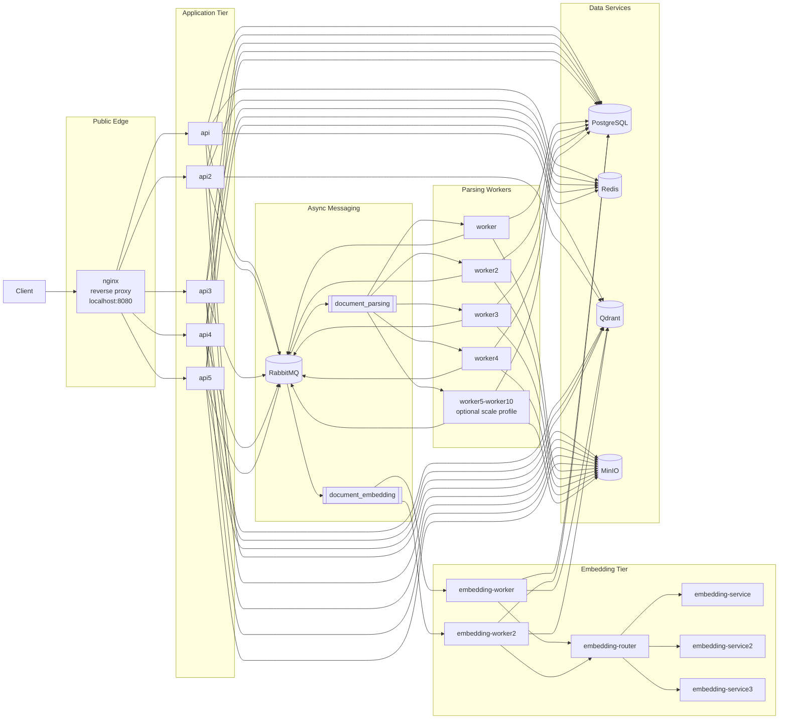

# Distributed Semantic Retrieval System

This project is a semantic search system for PDF documents. Users can sign up, upload PDFs, wait for background processing, and run semantic search queries against the indexed content.

## What is included

- FastAPI API service
- Dedicated embedding service
- PostgreSQL for users and document metadata
- RabbitMQ for background task queues
- Redis for query embedding cache
- Qdrant for vector search
- MinIO for object storage
- Four parsing workers by default, with six more available behind the optional `scale` profile
- Two embedding workers
- Three embedding-service replicas behind an internal router
- Nginx reverse proxy on `http://localhost:8080`

All required services are containerized and started by a single `docker-compose up`.

## TA Quick Start

From a fresh clone:

```bash
cp .env.example .env
docker-compose up --build
```

Wait for the API to become ready:

```bash
curl http://localhost:8080/health
curl http://localhost:8080/ready
```

Expected responses:

```json
{"status":"ok"}
{"status":"ready"}
```

The automated tests can then target `http://localhost:8080`.

If `8080` is already in use on a shared machine, set a different host port before starting:

```bash
cp .env.example .env
sed -i 's/^NGINX_HOST_PORT=.*/NGINX_HOST_PORT=18080/' .env
docker-compose up --build
```

Then use `http://localhost:18080` for manual testing on that shared host. Keep the default `8080` for TA grading on a clean machine.

## First Run Notes

- The first build is the slowest because the image installs Python dependencies and embedding service assets.
- Later restarts are much faster because the Docker image layers and named volumes are reused.
- No local Python environment, database, or filesystem path setup is required.
- The runtime images are split by role so parsing, embedding, and API services can scale independently while keeping builds deterministic.
- The default parsing backend is `pymupdf_blocks`, which avoids the heavy Docling warmup path for normal PDF ingestion.

## Common Commands

Start the full system:

```bash
docker-compose up --build
```

Stop the system:

```bash
docker-compose down
```

Stop the system and remove named volumes:

```bash
docker-compose down -v
```

View container status:

```bash
docker-compose ps
```

View logs:

```bash
docker-compose logs -f nginx api worker embedding-worker embedding-router
```

## API Smoke Test

Create a user:

```bash
curl -X POST http://localhost:8080/auth/signup \
  -H "Content-Type: application/json" \
  -d '{"username":"demo","password":"123456789"}'
```

Log in:

```bash
curl -X POST http://localhost:8080/auth/login \
  -H "Content-Type: application/json" \
  -d '{"username":"demo","password":"123456789"}'
```

Upload a PDF after replacing `<TOKEN>` and `/path/to/file.pdf`:

```bash
curl -X POST http://localhost:8080/documents \
  -H "Authorization: Bearer <TOKEN>" \
  -F "file=@/path/to/file.pdf;type=application/pdf"
```

List documents:

```bash
curl -X GET http://localhost:8080/documents \
  -H "Authorization: Bearer <TOKEN>"
```

Run search:

```bash
curl -G http://localhost:8080/search \
  -H "Authorization: Bearer <TOKEN>" \
  --data-urlencode "q=example query"
```

## Services

- `nginx` exposes the public API on port `8080`
- `api` through `api5` run the FastAPI application behind nginx
- `worker` through `worker4` process PDF parsing tasks by default
- `worker5` through `worker10` are available behind the optional `scale` compose profile
- `embedding-worker` and `embedding-worker2` handle embedding/indexing tasks
- `embedding-service`, `embedding-service2`, and `embedding-service3` serve embeddings behind `embedding-router`

## Architecture Diagram



If you paste this into Mermaid Live, paste only the diagram body starting at `flowchart LR`, not the surrounding triple backticks.

## Environment Configuration

All required environment variables are listed in `.env.example`. The default values are set for local Docker Compose usage, so the standard workflow is:

```bash
cp .env.example .env
docker-compose up --build
```

If you need to change the public port, update `NGINX_HOST_PORT` in `.env`.

## Scale Notes

This branch is tuned for higher throughput rather than the smallest possible footprint:

- parsing workers default to `PARSE_WORKER_CONCURRENCY=1` so PDF parsing jobs do not overcommit CPU/RAM per container
- embedding workers default to `EMBEDDING_WORKER_CONCURRENCY=2`
- Celery uses `worker_prefetch_multiplier=1` so long-running parse tasks are distributed more evenly
- the app points to `embedding-router`, which load-balances across three embedding-service replicas
- `PDF_EXTRACTOR_BACKEND` defaults to `pymupdf_blocks`; set it to `docling` only if you explicitly want the older parser path

## Design Decisions And Engineering Reasoning

### Why This Architecture

- The system separates synchronous API work from asynchronous document processing so user-facing requests stay responsive while heavy ingestion continues in the background.
- PDF parsing and embedding/indexing are split into different worker tiers because they have different runtime characteristics and scale differently under load.
- Stateless API replicas sit behind nginx so search and authentication traffic can scale horizontally without changing application logic.
- Stateful services are isolated by responsibility: PostgreSQL stores relational metadata, MinIO stores uploaded files, Redis caches query embeddings, RabbitMQ coordinates background work, and Qdrant serves vector similarity search.

### Technology Choices

- **FastAPI** was used for the API because it provides a clean async-friendly Python web stack, automatic OpenAPI generation, and simple health/readiness endpoints.
- **Celery + RabbitMQ** were used for background processing because the document pipeline is naturally queue-based and benefits from decoupled, retryable workers.
- **PostgreSQL** was used for users, authentication state, and document metadata because the data model is relational and consistency matters.
- **MinIO** was used for object storage because uploaded PDFs should be stored outside the API containers and accessed consistently across worker replicas.
- **Qdrant** was used for semantic search because it is purpose-built for vector similarity search and supports metadata filtering, which is required for per-user isolation.
- **Redis** was used to cache query embeddings so repeated searches do not always recompute the same embedding vectors.
- **nginx** was used as the front-door reverse proxy because it provides a simple, production-style way to expose a single public endpoint and balance requests across API replicas.
- **Docker Compose** was used because the project requirements call for a single command that starts the full stack on a clean machine.

### Parser Choice

- The project originally explored a Docling-based path, but real testing showed that it introduced heavy warmup/runtime overhead and much slower parsing on representative PDFs.
- The final default parser is `pymupdf_blocks` because it produced acceptable chunk quality for this project while dramatically reducing ingestion latency and making worker scaling practical.
- This was a deliberate trade-off: rich layout extraction was deprioritized in favor of reliable throughput and lower operational cost.

## Horizontal Scalability Analysis

### How The System Scales

- **API tier:** scaled horizontally by running five equivalent FastAPI replicas behind nginx.
- **Parsing tier:** scaled horizontally by running multiple dedicated parse workers consuming `document_parsing`.
- **Embedding tier:** scaled horizontally in two places:
  - embedding workers consume `document_embedding`
  - embedding-service replicas sit behind `embedding-router`
- **Storage/search tier:** Qdrant, PostgreSQL, RabbitMQ, Redis, and MinIO are shared backing services for all replicas.

### What Scales Well

- Search throughput scales well with additional API replicas until the backend vector search path becomes the limiting factor.
- Parsing throughput scales well after the PyMuPDF pivot because parse tasks are much shorter and no longer dominate worker CPU time.
- Embedding generation benefits from separate worker and service pools, which prevents parsing load from directly starving embedding requests.

### What Does Not Scale Indefinitely

- Qdrant is still a shared backend, so eventually search concurrency is limited by vector search and filtered retrieval performance.
- RabbitMQ and PostgreSQL remain shared dependencies, so they can become secondary bottlenecks at higher throughput.
- Docker Compose is effective for local/containerized orchestration, but it is not a full cluster scheduler and is not intended for elastic production autoscaling.

## End-To-End Data Flow

### Upload And Indexing Path

1. A client uploads a PDF through nginx to one of the API replicas.
2. The API stores document metadata in PostgreSQL and the file in MinIO.
3. The API enqueues a parsing task in RabbitMQ on `document_parsing`.
4. A parse worker downloads the file from MinIO, extracts chunk text, and records parsing progress.
5. The parse stage enqueues an embedding/indexing task on `document_embedding`.
6. An embedding worker requests vectors from `embedding-router`, which load-balances across the embedding-service replicas.
7. The embedding worker writes vectors and payload metadata into Qdrant and updates final status in PostgreSQL.

### Search Path

1. A client sends a search request through nginx to an API replica.
2. The API checks Redis for a cached query embedding.
3. If needed, the API gets a fresh query embedding from the embedding tier and caches it.
4. The API queries Qdrant with vector similarity plus `user_id` filtering.
5. The API returns ranked results and metadata to the client.

## Performance Testing And Bottleneck Analysis

### Hardware Tested

- CPU: 8 vCPUs (`QEMU Virtual CPU version 2.5+`, KVM virtualized)
- RAM: 31 GiB total
- Disk: 19 GiB root volume, 3.7 GiB free at test time

### Load Testing Methodology

- Tool used: Locust `2.43.4`
- Primary command pattern:

```bash
docker compose --profile loadtest run --rm locust \
  --headless -u <USERS> -r <SPAWN_RATE> -t <DURATION> \
  --only-summary --exit-code-on-error 1 <SCENARIO>
```

- Scenarios used:
  - `WarmSearchUser`: signs up, logs in, uploads a seed PDF, waits for indexing, then drives repeated search traffic
  - `UploadOnlyUser`: signs up, logs in, uploads PDFs, polls document state, and searches while ingestion is active
- Monitoring used during the runs:
  - `docker stats` for CPU and memory hot spots
  - `rabbitmqctl list_queues name messages consumers` for queue backlog and consumer counts
  - container logs for API, worker, and Qdrant failure signatures
- Report format:
  - the README records the measured numeric summaries from the headless Locust runs
  - no separate Locust chart export or screenshot set is committed in this repository

Because this shared machine already had another stack bound to `localhost:8080`, benchmark runs were executed locally with only the developer `.env` changed to `NGINX_HOST_PORT=18080`. `.env.example` remains at `8080` for TA grading.

### Measured Results

| Scenario | Users | Duration | Requests/sec | Mean latency | P50 | P95 | P99 | Failures |
| --- | ---: | ---: | ---: | ---: | ---: | ---: | ---: | ---: |
| Warm search | 50 | 45s | 29.20 | 45 ms | 26 ms | 130 ms | 290 ms | 0.00% |
| Warm search | 150 | 60s | 89.25 | 54 ms | 26 ms | 120 ms | 850 ms | 0.00% |
| Upload-heavy mixed flow | 20 | 60s | 10.48 | 110 ms | 74 ms | 180 ms | 520 ms | 0.00% |
| Warm search | 200 | 60s | 82.97 | 705 ms | 620 ms | 1600 ms | 1900 ms | 0.55% |
| Warm search | 250 | 60s | 104.54 | 685 ms | 590 ms | 1600 ms | 2000 ms | 2.12% |

Additional endpoint-level detail from the stable 150-user warm-search run:

- Total requests: `5314`
- Search requests: `4495`
- Search throughput: `75.49 req/s`
- Search latency: mean `52 ms`, P50 `25 ms`, P95 `120 ms`, P99 `850 ms`
- Failures: `0`

Additional endpoint-level detail from the 20-user upload-heavy run:

- Total requests: `624`
- Upload requests: `276`
- Upload throughput: `4.63 req/s`
- Upload latency: mean `86 ms`, median `87 ms`, max `205 ms`
- Search latency during active ingestion: mean `46 ms`, median `33 ms`, max `301 ms`

### Maximum Concurrent Users And Point Of Failure

- Maximum concurrent users handled cleanly in the warm-search scenario: `150`
- Performance degradation begins around `200` concurrent warm-search users
- Clear instability appears by `250` concurrent warm-search users

Observed failure mode at the limit:

- client-side `RemoteDisconnected("Remote end closed connection without response")`
- client-side `ConnectionResetError(104, "Connection reset by peer")`
- long-tail latency growth into the `1.6s` to `2.0s` range at P95/P99

The system did not hard-crash during these tests, but the public search path stopped meeting clean-service expectations once concurrency rose past roughly `150` warm users on the tested hardware.

### Bottleneck Identification

The original bottleneck was PDF parsing. Earlier in the project, Docling-based parsing dominated ingestion time and made scaling parse workers expensive. On a representative real PDF, the old Docling path took about `12.09s`, while the PyMuPDF block-based parser produced the same five logical chunks in about `0.01s`.

After pivoting to `pymupdf_blocks`, parsing stopped being the bottleneck:

- parse queues stayed near zero during load
- parse workers were mostly idle, typically around `3%` to `7%` CPU in mixed ingestion runs and near `0%` in warm-search runs
- `document_parsing` and `document_embedding` queues drained instead of accumulating backlog

The bottleneck then shifted to the search-serving path under high concurrency:

- API replicas were the busiest steady components during warm-search load, reaching roughly `52%` to `57%` CPU each at `200` to `250` users
- Qdrant became materially hotter as search concurrency rose and is now part of the critical path
- RabbitMQ also consumed noticeable CPU during mixed traffic, but queue depths stayed low, so it was active without becoming the primary limiting symptom
- PostgreSQL remained warm but did not show the same failure signature as the search path

Profiling and monitoring evidence came from `docker stats`, RabbitMQ queue snapshots, and repeated correlation with request failures in Locust and API logs.

### Optimizations Implemented

- Replaced the default parsing backend with `pymupdf_blocks`
- Reduced default parse workers from ten to four, with extra workers behind the optional `scale` profile
- Kept parse-worker concurrency at `1` to avoid overcommitting CPU and RAM
- Load-balanced embedding generation behind `embedding-router` with three embedding-service replicas
- Added Qdrant query retries with client reset and timeout control
- Converted transient Qdrant search failures into controlled `503` responses instead of raw `500`s
- Added a Qdrant payload index on `user_id`
- Restricted Qdrant search payloads to only the fields the API needs

### Before And After Comparison

| Change | Before | After | Effect |
| --- | --- | --- | --- |
| Parsing backend | Docling | PyMuPDF blocks | Parsing time on a representative real PDF dropped from `12.09s` to `0.01s` |
| Default parse topology | 10 parse workers always on | 4 parse workers by default, 6 optional | Lower baseline resource use with no parse backlog in tested runs |
| Qdrant transient search handling | 150-user warm search showed 1 failure caused by Qdrant disconnect | 150-user warm search completed with 0 failures | Stable search under the same concurrency target |
| Qdrant filtering/search payload | default collection only | added `user_id` payload index and narrowed returned payload fields | Lower-cost filtered search path |

### System Limitations And Capacity Bounds

- This system is comfortably stable for mixed ingestion/search traffic at the tested `20`-user upload-heavy scenario
- It is also stable for at least `150` concurrent warm-search users on the tested 8-vCPU / 31-GiB machine
- The next practical ceiling is the public search-serving path, not parsing
- At `200+` concurrent warm-search users, latency rises sharply and connection resets begin to appear
- The current architecture is therefore best described as ingestion-capable and search-responsive at moderate-to-high concurrency, but not yet hardened for sustained `200+` warm-search users on this hardware tier

If more scaling work were needed, the next areas to target would be the API-to-Qdrant search path, Qdrant host resources/configuration, and front-door request handling under high concurrency.

## Challenges Encountered And Solutions

### 1. Parsing Was Initially The Dominant Bottleneck

- Problem: the earlier Docling-based path added heavy startup/runtime overhead and made document ingestion much slower than the rest of the system.
- Evidence: isolated parsing tests showed a representative real PDF taking about `12.09s` with Docling versus about `0.01s` with the PyMuPDF block extractor.
- Solution: pivoted the default parser to `pymupdf_blocks` and retuned worker counts around the new cost profile.

### 2. Over-Allocation Of Parse Workers Was No Longer Helpful

- Problem: once parsing became fast, a large always-on parse worker pool wasted resources without improving queue drain behavior.
- Evidence: parse workers stayed mostly idle and parse queue depth remained near zero during the later benchmark runs.
- Solution: reduced the default parse worker set to four and moved the extra workers into an optional `scale` profile.

### 3. Transient Qdrant Search Failures Appeared Under Search Load

- Problem: warm-search load initially produced a small number of request failures caused by upstream Qdrant disconnects.
- Evidence: the 150-user warm-search run previously showed a failure tied to a Qdrant transport error.
- Solution: added bounded retry logic, client reset between retries, timeout controls, and a controlled `503` failure path instead of surfacing raw backend exceptions.

### 4. Search Became The New Bottleneck After Parsing Was Fixed

- Problem: once ingestion was efficient, the limiting path moved to API-to-Qdrant search serving under high concurrency.
- Evidence: latency increased sharply at `200+` warm users, failure rates appeared, API replicas became the hottest steady components, and Qdrant became part of the critical path.
- Solution: added a Qdrant payload index on `user_id`, restricted returned payload fields, and documented the realistic concurrency bound on the tested machine.

### 5. Shared-Machine Port Conflicts Complicated Local Validation

- Problem: another Docker stack on the same host was already using port `8080`, which contaminated local public-endpoint testing.
- Evidence: nginx bind attempts and public-route behavior were inconsistent until the conflict was identified.
- Solution: kept `.env.example` at `8080` for TA grading, but used a local `.env` override to `18080` for uncontaminated benchmark runs on this shared machine.

## Trade-Offs And Limitations

- PyMuPDF-based chunk extraction is much faster than the earlier parser path, but it may preserve less document structure than heavier layout-aware pipelines.
- The architecture scales horizontally at the application and worker layers, but not all stateful services scale the same way under Docker Compose.
- Query embedding caching helps repeated searches, but cold searches still depend on the embedding and vector-search path.
- The final system is optimized for a course-project deployment model and reproducible Compose startup rather than full production-grade orchestration.

## Team Collaboration Workflow

This section should be customized to reflect the actual team process used in your group, but the report should explicitly answer the following:

- how tasks were divided across teammates
- how integration work was coordinated
- how merge conflicts were resolved
- how performance testing responsibilities were shared
- how design decisions were discussed and finalized

If you want a concise structure for the report, describe the workflow in terms of:

- feature ownership
- integration/testing checkpoints
- shared debugging sessions
- final validation before merge/submission

## Git Workflow Explanation

This section should also be adapted to your team’s real process. The report should clearly state:

- the branch strategy used for features, scaling changes, and integration
- how changes were merged back into the main submission branch
- whether code reviews, pair debugging, or manual validation were used before merge
- how risky changes were isolated and verified

A concise example structure is:

- feature branches for isolated work
- integration branch for combined testing
- merge validation using `docker-compose up`, API smoke tests, and load tests
- final submission branch locked after TA-path validation

## AI Usage Disclosure

If AI tools were used, the report should disclose them clearly and specifically. A strong disclosure section should include:

- which AI tools were used
- what kinds of tasks they assisted with
- how outputs were reviewed, tested, or corrected by the team
- where human engineering judgment changed or rejected suggested solutions

Keep this factual and restrained. The important point is to show responsible use, verification, and ownership of the final system.

## Suggested Figures And Tables For The PDF Report

To make the report easier to grade, the following visuals are worth including:

- system architecture diagram
- one upload/indexing sequence diagram
- one search-request sequence diagram
- one benchmark table summarizing throughput, latency, and failure rates
- one before/after optimization table
- one or two Locust graphs showing users, requests/sec, and latency over time
- one concise table of bottlenecks, evidence, fixes, and outcomes

## References And Citation Checklist

The report should cite:

- official documentation for major technologies used
- any external sources used to justify architectural choices
- any benchmarks or references used to compare parser/vector-search options
- any AI tools used, if applicable

At minimum, you will likely want citations for:

- FastAPI
- Celery
- RabbitMQ
- PostgreSQL
- Redis
- MinIO
- Qdrant
- PyMuPDF
- Locust
- any AI tool disclosed in the report
